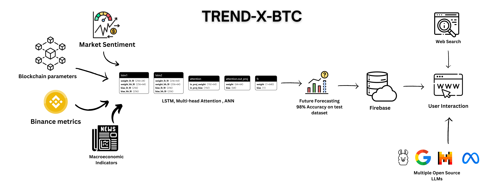

# TREND-X-BTC: Bitcoin 30 Days Forecasting with LSTMs and Multi-Head Attention Mechanism
<div style="width: 400px; height: 300px; overflow: hidden;">
  
</div>
## Table of Contents
- [Overview](#overview)
- [Key Features](#key-features)
- [Tech Stack](#tech-stack)
- [Getting Started](#getting-started)
- [Project Structure](#project-structure)
- [Contributing](#contributing)
- [License](#license)
- [Contact](#contact)

## Overview
**TREND-X-BTC** is an advanced cryptocurrency price prediction system leveraging LSTM neural networks combined with attention mechanisms to forecast Bitcoin prices with an impressive 98% accuracy. The project integrates real-time market data, sentiment analysis, and blockchain metrics to deliver comprehensive insights and accurate forecasts, empowering users to make confident and informed trading decisions.

## Key Features
- **Advanced Neural Architecture:** LSTM networks with attention mechanism achieving 98% prediction accuracy.
- **Real-time Data Integration:** Live market data from Binance, sentiment analysis, and blockchain metrics.
- **Interactive Dashboard:** Real-time visualization and analysis tools.
- **AI-Powered Chat:** Multiple language models with web searching capabilities.
- **Automated Predictions:** Scheduled predictions and notifications system.
- **3D Visualization:** Enhanced Bitcoin model with dynamic animations and effects.

## Tech Stack
- **Frontend:**
  - Next.js 14
  - TypeScript
  - Framer Motion
  - Three.js
  - TailwindCSS
  
- **Backend & Services:**
  - Firebase
  - Clerk Authentication
  - Binance API
  - Multiple LLM Integration
  
- **Data Sources:**
  - Binance (Real-time cryptocurrency data)
  - Alternative.me (Market sentiment)
  - FRED (Macroeconomic indicators)
  - Google BigQuery (Blockchain metrics)

## Getting Started

First, install the dependencies:
```bash
npm install
# or
yarn install
# or
pnpm install
```

Run the development server:

```bash
npm run dev
# or
yarn dev
# or
pnpm dev
```

Open [http://localhost:3000](http://localhost:3000) with your browser to see the result.

## Project Structure
```bash
src/
├── app/                    # App router components
├── components/             # Reusable components
├── pages/                  # Page components
│   ├── api/               # API routes
│   ├── auth/              # Authentication pages
│   ├── dashboard/         # Dashboard views
│   └── prediction/        # Prediction interface
├── config/                # Configuration files
└── styles/                # Global styles
```

## Contributing
We welcome contributions! Please follow these steps:
1. Fork the repository.
2. Create a feature branch.
3. Commit your changes.
4. Push to the branch.
5. Open a Pull Request.

## License
This project is licensed under the MIT License.

## Contact
For questions or collaboration, contact [ahsentahir@gmail.com](mailto:ahsentahir@gmail.com).

© 2024 TREND-X-BTC. All rights reserved.
